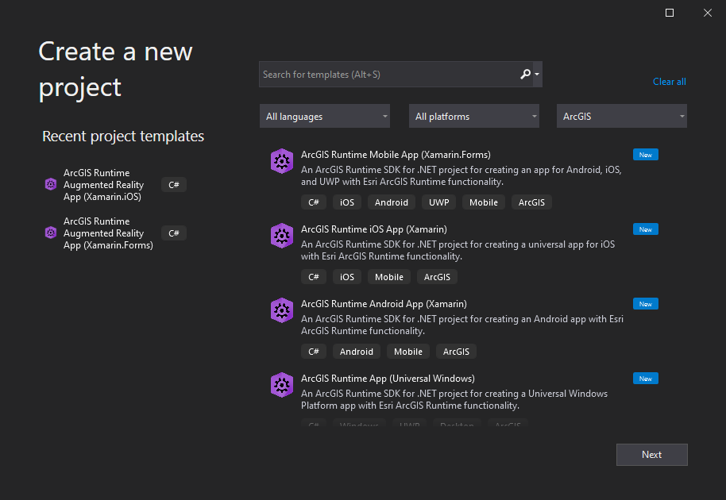

# ArcGIS Runtime SDK for .NET - Visual Studio Project Templates

<!-- This should be a common header for all SDK resources; everything is a link except the current page -->

 

<a href="https://www.nuget.org/profiles/Esri_Inc">  

**Project templates offer an ideal starting point for building apps with ArcGIS Runtime.**

<!-- Options: Centered image, gallery, side image -->
<!-- Use gallery for multi-projects (e.g. Demos repo), centered image for desktop/iPad apps, side image for phone apps -->

<table>
<tr>
<td align="center">

</td>
<td align="center">

</td>
</tr>
<tr>
<td align="center"><b>Project Templates</b></td>
<td align="center"><b>AR Project Templates</b></td>
</tr>
</table>

## Get started

To get started, download the extension from Visual Studio Marketplace:

- [Augmented Reality (AR) Project Templates](https://marketplace.visualstudio.com/items?itemName=Esri.EsriArcGISRuntimeARTemplates)
- [Non-AR Project Templates](https://marketplace.visualstudio.com/items?itemName=Esri.ArcGISRuntimeTemplates)

> **NOTE**: This repo only includes the source for the AR project templates.

## Notes and requirements

These templates require Visual Studio 2017 or later, running on Windows.

Building the templates VSIX requires the Visual Studio Extensibility SDK.

## Contributing

Anyone and everyone is welcome to [contribute](https://github.com/Esri/arcgis-runtime-samples-dotnet/wiki/Contributing).

## License

Copyright 2021 Esri

Licensed under the Apache License, Version 2.0 (the "License");
you may not use this file except in compliance with the License.
You may obtain a copy of the License at

https://www.apache.org/licenses/LICENSE-2.0

Unless required by applicable law or agreed to in writing, software
distributed under the License is distributed on an "AS IS" BASIS,
WITHOUT WARRANTIES OR CONDITIONS OF ANY KIND, either express or implied.
See the License for the specific language governing permissions and
limitations under the License.

A copy of the license is available in the repository's [license.txt](/license.txt) file.
